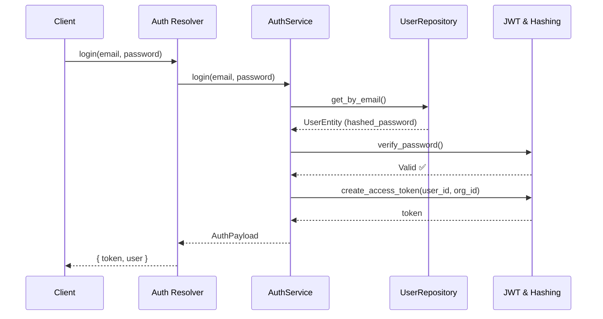
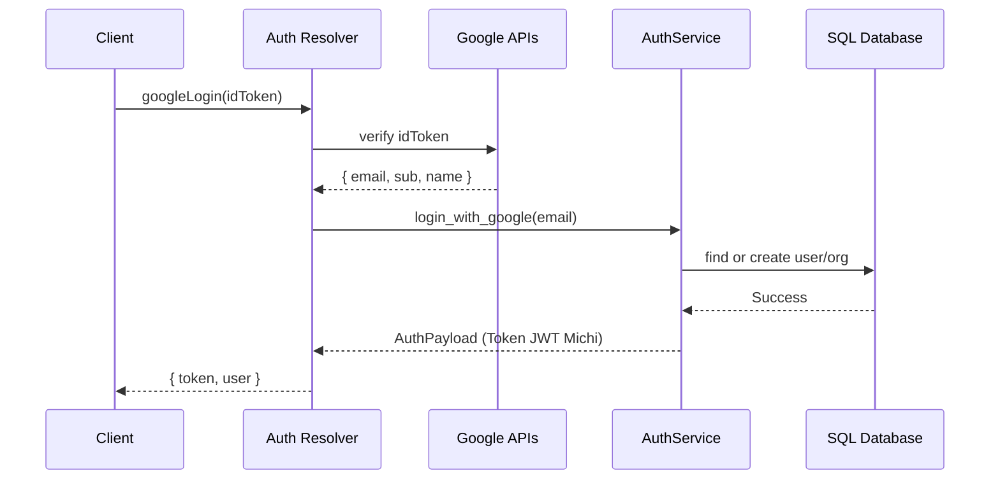

# Flux Authentification JWT

## Login classique



## Google OAuth



## Token JWT

```json
{
  "user_id": "uuid",
  "org_id": "uuid | null",
  "email": "user@example.com",
  "exp": 1234567890
}
```

Expiration : **24h** (configurable via `ACCESS_TOKEN_EXPIRE_HOURS`).

## RBAC — Rôles

| Rôle | Droits |
|------|--------|
| `ADMIN` | Tous les droits |
| `MANAGER` | Lecture + écriture produits/commandes |
| `VIEWER` | Lecture seule |

Les droits granulaires sont stockés dans `organization_members.permissions` (JSONB).
