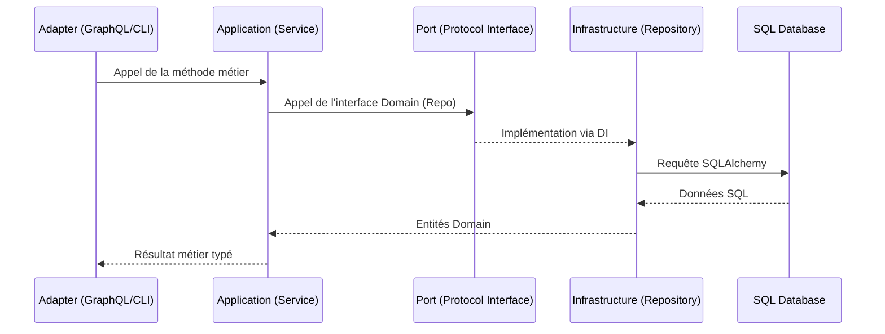

# Domain-Driven Design & Architecture Hexagonale

Michi 道 applique une architecture hexagonale (Ports & Adapteurs) pour isoler le cœur métier des détails techniques (base de données, APIs externes).

## 🏙️ Structure des Modules

Chaque module (auth, inventory, forecasting, etc.) suit cette structure interne :

```text
src/modules/[module_name]/
├── domain/              # Port (Entities, Value Objects, Repository Interfaces)
│   ├── entities.py
│   └── repository.py    # Interface abstraite
├── application/         # Orchestration (Services)
│   └── service.py       # Logique métier pure
├── infrastructure/      # Adapter (Persistence, External APIs)
│   └── repositories/
│       └── sqlalchemy.py # Implémentation réelle
└── adapters/            # Adapter (GraphQL, CLI)
    └── resolvers.py    # Point d'entrée GraphQL
```



## 🔌 Ports et Adapteurs

### Le Port (Domain)
C'est l'interface définie par le domaine pour interagir avec le monde extérieur.
Exemple : `IProductRepository` définit que l'on doit pouvoir "récupérer un produit", mais ne sait pas comment.

### L'Adapteur (Infrastructure)
C'est l'implémentation concrète.
Exemple : `SQLAlchemyProductRepository` utilise la session DB pour exécuter du SQL.

## ⚖️ Avantages
1. **Testabilité :** On peut tester les services avec des "FakeRepositories" (en mémoire) sans base de donnée.
2. **Maintenance :** Changer de base de données ou de framework API n'impacte pas la logique métier.
3. **Clarté :** La séparation des responsabilités est explicite.
