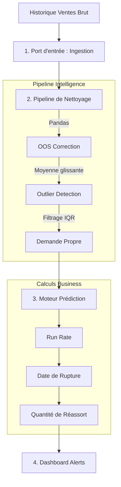

# Pipeline de Prévision

Le cœur de Michi 道 repose sur un pipeline de traitement de données rigoureux pour assurer des prédictions fiables malgré les bruits (ruptures de stock, promotions, anomalies).

## 🔄 Flux de Traitement

### 1. Correction des Ruptures (Stockout Correction)
Les ventes réelles tombent à zéro quand le stock est épuisé. Pour prédire la demande future, nous devons injecter une **demande théorique** pour ces jours.
- **Méthode :** Moyenne glissante des 14 derniers jours de vente connus.

### 2. Détection d'Anomalies (Outlier Detection)
Les pics de vente inhabituels (ventes flash, influenceurs) ne doivent pas fausser la tendance long terme.
- **Méthode :** Interquartile Range (IQR). Les valeurs > Q3 + 1.5*IQR sont plafonnées à la médiane.

### 3. Calcul du Run Rate
Une fois les données nettoyées, nous calculons la cadence de vente actuelle.
- **Méthode :** Moyenne pondérée des 30 derniers jours nettoyés.

### 4. Projection de Rupture
Estimation de la date de fin de stock basée sur le stock actuel et le Run Rate.
- **Formule :**
  $$DateRupture = DateActuelle + \frac{StockActuel}{RunRate}$$

## 📊 Visualisation

Le pipeline transforme les données brutes (en rouge) en données de demande "propre" (en bleu) prêtes pour l'algorithme de prédiction.

:::tip
Toutes les formules mathématiques détaillées sont disponibles dans la section [Algorithmes](/algorithms/math).
:::
