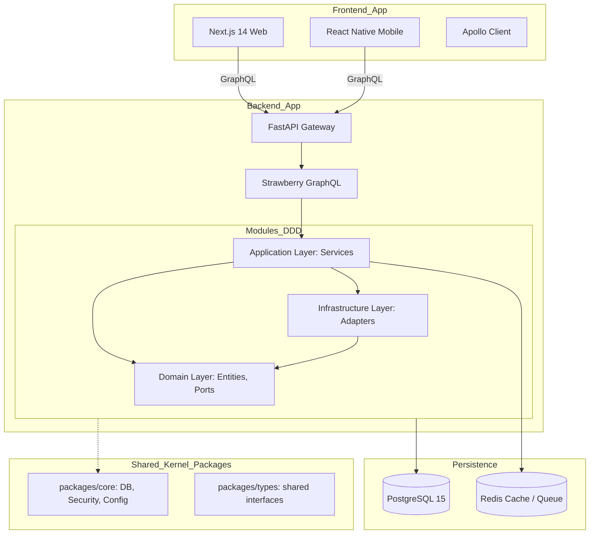
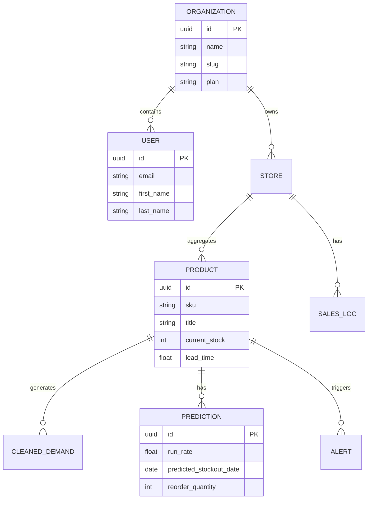

# Vue d'Ensemble Architecture

## 1. Architecture Globale

Michi 道 utilise une architecture moderne découplée, optimisée pour la performance et la scalabilité.

### 1.1 Stack Technique
- **Backend :** Python 3.12, FastAPI, Strawberry, SQLAlchemy 2.0 (Async).
- **Frontend :** TypeScript, Next.js 14, Apollo Client, Tailwind CSS, shadcn/ui.
- **Infrastructure :** Docker, PostgreSQL, Redis.

### 1.2 Schéma Relationnel (ERD)

L'architecture de données de Michi est conçue pour le multi-tenancy (SaaS) avec une isolation forte par organisation.

### 1.3 Principes Clés
1. **Modularity (DDD) :** Chaque domaine métier est isolé.
2. **API-First (GraphQL) :** Un contrat unique et typé.
3. **Stateless :** Authentification JWT, pas de sessions côté serveur.
4. **Async-Everywhere :** Utilisation intensive de `async/await` pour la performance I/O.
